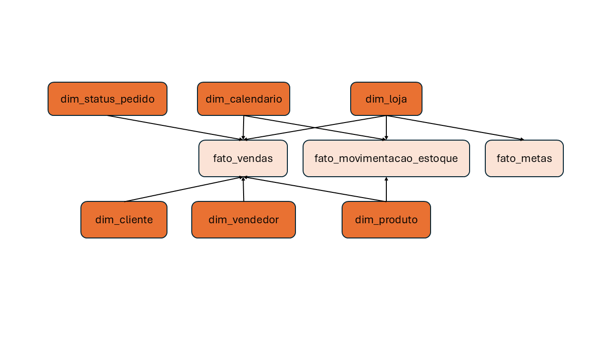

# Amplo Varejo S.A. — Plataforma de Dados e Simulação Empresarial

> Ecossistema de dados de ponta a ponta simulando a operação de uma rede varejista nacional: da construção do negócio e geração de dados com regras reais, até um Data Warehouse dimensional e dashboards executivos em Power BI.


<table>
  <tr>
    <td width="33%" valign="top">
      
    </td>
    <td width="33%" valign="top">
      
    </td>
    <td width="33%" valign="top">
      
    </td>
  </tr>
</table>

---

## Sobre o projeto

A Amplo Varejo S.A. é uma empresa fictícia de varejo nacional, criada para simular o trabalho completo de um profissional de Dados — não apenas analisar dados prontos, mas construir o ecossistema que os gera, valida, armazena e transforma em decisão.

O projeto cobre: definição de regras de negócio → geração de dados sintéticos com Python → validação de qualidade → carga em banco OLTP (MySQL) → ETL para Data Warehouse dimensional (Star Schema) → dashboards em Power BI → recomendações de negócio.

📄 Documentação completa da empresa: [Documento de abertura](documentos/documento_de_abertura.md)

## O Problema de Negócio

A diretoria da **Amplo Varejo S.A.** identificou uma **queda aproximada de 12% no faturamento** anual. Apesar de possuir dados detalhados sobre vendas, lojas, regiões, produtos, vendedores e metas, a empresa não consegue identificar com clareza a causa raiz nem a distribuição dessa perda.

## Pergunta Central do Projeto
> *"Onde está ocorrendo a queda do faturamento e quais fatores podem estar relacionados a esse comportamento?"*

Essa pergunta orienta todas as etapas de geração, engenharia, transformação e análise dos dados.

## Diagnóstico e Lacunas Identificadas
A análise busca responder às seguintes dúvidas estratégicas da diretoria:
* **Concentração Geográfica:** Onde a queda está concentrada e quais regiões/lojas apresentaram maior redução?
* **Mix de Produtos:** Quais categorias e produtos específicos contribuíram para a perda de faturamento?
* **Desempenho de Equipe:** Existem diferenças relevantes no desempenho entre os vendedores?
* **Atingimento de Metas:** As metas operacionais e comerciais estão sendo alcançadas?
* **Fatores Externos e Operacionais:** Como a sazonalidade, campanhas promocionais e a disponibilidade de estoque impactaram o resultado observado?

---

## Objetivos do Projeto

### Objetivo Geral
Investigar detalhadamente a redução de ~12% no faturamento da Amplo Varejo S.A., mapeando os gargalos comerciais e identificando os principais fatores associados ao resultado.

### Objetivos Específicos
- Mapear a concentração geográfica da queda, por região e por loja.
- Identificar categorias e produtos que mais contribuíram para a perda de faturamento.
- Comparar o desempenho comercial entre vendedores.
- Verificar o atingimento das metas operacionais e comerciais.
- Analisar o impacto de sazonalidade, campanhas promocionais e disponibilidade de estoque no resultado observado.

## Arquitetura da solução

<p align="center">
  
</p>
<p align="center">
  <em>Fluxo de dados da Amplo Varejo S.A., desde a geração dos dados até a camada analítica.</em>
</p>

```
Configurações → Geração (Python/Faker) → Validação → CSV → MySQL (OLTP) → ETL → Data Warehouse (Star Schema) → Power BI
```
---
## Jornada do Projeto

Da formalização inicial à entrega dos insights, esta seção documenta, passo a passo, como o ecossistema de dados da Amplo Varejo foi construído — do Project Charter ao dashboard final.

### 1. Documento de Abertura do Projeto (Project Charter)
Com o problema de negócio e a pergunta central já definidos, o projeto foi formalizado em um Project Charter — documento que estabelece escopo, objetivos e diretrizes de execução da iniciativa.

- **Escopo Analítico:** Mapeamento do desempenho através de dimensões como Tempo, Regiões, Lojas, Categorias, Produtos, Vendedores, Metas e Estoque.

📄 Documento de abertura e diretrizes do projeto: [Documento de abertura](documentos/documento_de_abertura.md)

### 2. Mapeamento de Entidades e Atributos
A partir do escopo definido, foram identificadas e estruturadas as entidades essenciais para representar com precisão a operação comercial e logística da empresa:
- **Dados Mestres:** Estados, Lojas, Vendedores, Clientes, Categorias e Produtos.
- **Operações Transacionais:** Pedidos, Itens do Pedido, Estoque e Movimentações de Estoque.
- **Apoio e Governança:** Calendário, Sazonalidade, Campanhas, Eventos e Metas.

### 3. Definição das Regras de Negócio
Com as entidades e seus atributos delimitados, foram estabelecidas as regras operacionais indispensáveis para garantir a coerência do cenário varejista:
- **Restrições Geográficas e Cadastrais:** Cobertura de todos os 27 estados com distribuição proporcional de lojas por região (ex: Sudeste 45%, Sul 20%), além de unicidade estrita de CPF/E-mail para clientes.
- **Lógica Comercial e Operacional:** Vendedores vinculados exclusivamente à loja do pedido, validações de preço versus custo, e saídas de estoque condicionadas estritamente a pedidos efetivamente finalizados (prevenindo reduções por pedidos cancelados ou saldos negativos).

📄 Documento de regras de negócio detalhado: [Regras de Negócio](documentos/regras_de_negocio.md)

### 4. Levantamento de Requisitos do Sistema
Para traduzir as regras de negócio em um ecossistema de software e dados, foram formalizados **17 Requisitos Funcionais (RF)** e **8 Requisitos Não Funcionais (RNF)**:
- **Automação e Reprodutibilidade:** Controle de aleatoriedade via semente configurável (`SEMENTE_ALEATORIA = 42`) e suporte a múltiplos modos de execução (*desenvolvimento*, *teste* e *produção*).
- **Integridade e Qualidade:** Implementação de rotinas de validação automática para rastrear registros ausentes, inconsistências dimensionais ou falhas de estoque antes da carga nos ambientes OLTP e DW.

📄 Documento de requisitos do sistema: [Requisitos do Sistema](documentos/requisitos_do_sistema.md)

### 5. Banco Operacional (OLTP)
A partir do levantamento de requisitos, o ponto de partida para a criação é o **MER**, organizado em 4 grupos de entidades: Cadastros Mestres, Operações Comerciais, Operações Logísticas e Gestão e Apoio.

<p align="center">
  
</p>

A partir do MER, o modelo foi implementado fisicamente em MySQL. O banco `amplo_varejo` **não é populado manualmente** — ele é criado e abastecido inteiramente pelos dados gerados no motor de simulação em Python, só depois de passarem pelas validações de cobertura, integridade e estoque.

<p align="center">
  
</p>

📄 Modelo físico completo (tabelas, tipos, chaves): [`sql/01_modelo_fisico_bd.sql`](sql/01_modelo_fisico_bd.sql) · código de carga: [`codigo/exportadores/exportar_mysql.py`](codigo/exportadores/exportar_mysql.py)

### 6. Geração de Dados e Motor de Simulação (Python)
Com o banco relacional modelado, foi desenvolvido o motor de simulação em Python — orientado a objetos — responsável por gerar dados sintéticos de alta fidelidade e reproduzir a dinâmica operacional e comercial da empresa, do cadastro de lojas e produtos até a última venda registrada.

A construção segue três camadas:
- Primeiro vêm os **dados mestres** (estados, lojas, vendedores, clientes, produtos e categorias), que dão a fotografia inicial da empresa.
- Em seguida, o **motor de simulação** dá vida a esses dados ao longo do tempo, aplicando sazonalidade, campanhas promocionais — como Black Friday e Queima de Estoque — e eventos de mercado que simulam quedas de demanda, gargalos logísticos ou crises pontuais.
- Por fim, as **operações transacionais** geram os pedidos, os itens vendidos e a movimentação de estoque, sempre respeitando a relação entre loja e produto.

Antes de qualquer exportação, os dados passam por uma suíte de validações automatizadas que garante cobertura completa — os 27 estados com lojas, vendedores e pedidos ativos —, integridade referencial e consistência de estoque, sem saldos negativos ou relacionamentos órfãos. Só depois de aprovados nessas checagens os dados seguem para a staging area em CSV, pronta para alimentar o banco operacional.

📄 Dados mestres: [`codigo/geradores/mestres/`](codigo/geradores/mestres/)
📄 Lógica de simulação: [`codigo/simulacao/`](codigo/simulacao/)
📄 Operações transacionais: [`codigo/geradores/operacoes/`](codigo/geradores/operacoes/)
📄 Validações de qualidade: [`codigo/validacoes/`](codigo/validacoes/)

### 7. Data Warehouse (Star Schema)
Com o OLTP populado e validado, o ETL transforma esses dados operacionais num modelo dimensional — 6 dimensões e 3 fatos (`fato_vendas`, `fato_movimentacao_estoque`, `fato_metas`) — otimizado para consulta analítica.

<p align="center">
  
</p>


O Data Warehouse é abastecido automaticamente a partir do banco OLTP: o ETL lê as tabelas do `amplo_varejo`, aplica as transformações dimensionais e carrega o `amplo_varejo_dw`, sem intervenção manual.

📄 Modelo físico do DW: [`sql/02_star_schema.sql`](sql/02_star_schema.sql)) · código de carga: [`codigo/dw/atualizar_dw.py`](codigo/dw/atualizar_dw.py)

### 8. Dashboard
Com o Data Warehouse estruturado, os dados são transformados em informações para tomada de decisão por meio de um dashboard interativo desenvolvido no Power BI.

O dashboard é composto por 4 páginas, cada uma direcionada a uma perspectiva do negócio, permitindo acompanhar indicadores de performance comercial, produtos, clientes, estoque e metas.

As métricas foram construídas utilizando DAX diretamente sobre o modelo dimensional, permitindo análises dinâmicas por período, região, loja e demais dimensões, sem depender de dados previamente agregados em SQL.

<p align="center">
  
</p>

📊 Acessar Dashboard Interativo: [Dashboard Gerencial - Amplo Varejo](https://app.powerbi.com/groups/me/reports/6c99b626-4f11-4e71-afde-18bc470d4392?ctid=da49a844-e2e3-40af-86a6-c3819d704f49&pbi_source=linkShare&bookmarkGuid=72150cd0-17b6-42bf-8068-ace9ab46231c)

<p align="center">
  
</p>

As principais métricas utilizadas no dashboard, juntamente com suas respectivas regras de cálculo, estão documentadas em [Medidas DAX](documentos/dax.md)

### 9. Principais Insights
- **Taxa de cancelamento acima da meta:** o indicador atingiu 9,8%, significativamente acima da meta empresarial de 3%, representando o principal impacto financeiro identificado na análise.
- **Baixo giro de estoque:** foram identificados produtos com baixa saída em relação ao volume mantido em estoque, resultando em aproximadamente R$ 357 mil em capital imobilizado e indicando oportunidades de redistribuição, campanhas e revisão de compras.
- **Lojas abaixo da meta:** um subconjunto de lojas apresentou desempenho comercial abaixo do esperado, com um gap estimado de R$ 273 mil, demandando diagnóstico individual para identificar se a causa está relacionada a fluxo de clientes, conversão, mix, estoque ou desempenho dos vendedores.

> Os três problemas representam um impacto financeiro estimado de R$ 2,1 milhões, direcionando a priorização das ações entre Operações, Estoque e Comercial.

📄 Análise completa e recomendações: [Análise e Recomendações](documentos/acoes_recomendacoes.md)

---

## Stack

| Camada | Tecnologia |
|---|---|
| Geração de dados | Python, Pandas, Faker |
| Banco operacional | MySQL (OLTP) |
| ETL | Python, SQLAlchemy |
| Data Warehouse | MySQL — Star Schema |
| Visualização | Power BI, DAX |
| Versionamento | Git, Conventional Commits |

## Estrutura do repositório

```
amplo-varejo/
│
├── codigo/
│   │
│   ├── configuracoes/
│   │   ├── configuracao.py
│   │   └── database.py
│   │
│   ├── dw/
│   │   └── atualizar_dw.py
│   │
│   ├── geradores/
│   │   │
│   │   ├── apoio/
│   │   │   ├── dados_simulacao.py
│   │   │   └── motor_simulacao.py
│   │   │
│   │   ├── mestres/
│   │   │   ├── estados.py
│   │   │   ├── lojas.py
│   │   │   ├── vendedores.py
│   │   │   ├── categorias.py
│   │   │   ├── produtos.py
│   │   │   └── clientes.py
│   │   │
│   │   └── operacoes/
│   │       ├── pedidos.py
│   │       ├── itens_pedido.py
│   │       ├── estoque.py
│   │       └── movimentacao_estoque.py
│   │
│   ├── simulacao/
│   │   ├── calendario.py
│   │   ├── sazonalidade.py
│   │   ├── demanda.py
│   │   ├── campanhas.py
│   │   ├── eventos.py
│   │   └── metas.py
│   │
│   ├── validacoes/
│   │   ├── cobertura.py
│   │   ├── integridade.py
│   │   ├── estoque.py
│   │   └── validar_simulacao.py
│   │
│   ├── utilitarios/
│   │   ├── catalogo_produtos.py
│   │   ├── faker.py
│   │   └── regioes.py
│   │
│   ├── exportadores/
│   │   ├── exportar_csv.py
│   │   └── exportar_mysql.py
│   │
│   └── pipeline.py
│
├── dados/
│   └── brutos_csv/
│
├── docs/
│   ├── documento_de_abertura.md
│   ├── regras_de_negocio.md
│   ├── acoes_recomendacoes.md
│   └── requisitos_do_sistema.md
│
├── sql/
│   ├── 01_modelo_fisico_bd.sql
│   ├── 02_star_schema.sql
│   ├── 03_JOINS.sql
│   └── 04_Views.sql
│
├── imagens/
│
├── requirements.txt
└── README.md

```

## Como executar

```bash
git clone https://github.com/matheusmendesgestaopessoal/amplo-varejo-simulador.git
pip install -r requirements.txt

# pipeline completo: geração → validação → CSV → OLTP → DW
python -m codigo.pipeline
```

Configurações de volume, período e semente aleatória em `codigo/configuracoes/configuracao.py`.

---

## Autor

**Matheus Mendes** — Estudante de Análise e Desenvolvimento de Sistemas (ADS), com foco em **Dados, Engenharia de Dados e Business Intelligence**.

**Stack:** Python · SQL · MySQL · ETL · Data Warehouse · Power BI · DAX

**Certificações:** CPA-10 · CPA Pro R — ANBIMA 

[LinkedIn](https://www.linkedin.com/in/matheusmendes-finan%C3%A7as/) · [GitHub](https://github.com/matheusmendesgestaopessoal)

